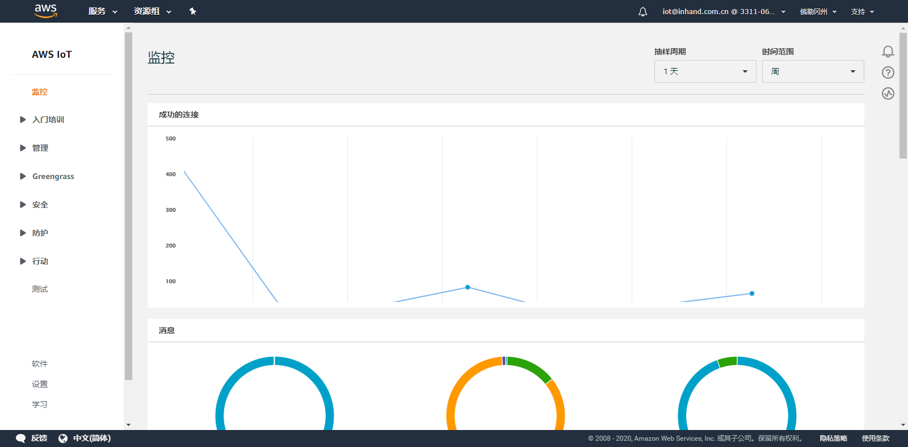

# AWS IoT Greengrass用户手册
AWS IoT Greengrass 是将云功能扩展到本地设备的软件。这使得设备可以更靠近信息源来收集和分析数据，自主响应本地事件，同时在本地网络上彼此安全地通信。本地设备还可以与 AWS IoT Core 安全通信并将 IoT 数据导出到 AWS 云。AWS IoT Greengrass 开发人员可以使用 AWS Lambda 函数和预构建的连接器来创建无服务器应用程序，这些应用程序将部署到设备上以进行本地执行。  

AWS IoT Greengrass SDK支持IG902作为AWS IoT Greengrass核心（以下简称Greengrass核心）实现Lambda 函数的部署与本地执行、使用托管订阅在 AWS IoT 与设备、连接器和 Lambda 函数之间进行的 MQTT 消息传递等功能，使您能够快速开发并完成任务，安全，高效地部署相关服务。本文档将为你说明如何基于AWS IoT Greengrass SDK实现通过AWS云平台在IG902上部署并运行Hello World Lambda函数，该函数会通过MQTT协议将Hello World消息发送到 AWS IoT，整体架构如下图所示：  

  - [先决条件](#prerequisites)
  - [1. 环境准备](#environmental-preparation)
    - [1.1 配置AWS IoT](#configure-aws-iot)
    - [1.2 配置IG902](#configure-ig902)
      - [1.2.1 基础配置](#basic-configure)
      - [1.2.2 连接AWS IoT Greengrass](#connect-to-aws-iot-greengrass)
  - [2. 部署并验证Lambda函数](#deploy-and-verify-the-lambda-function)
    - [2.1 部署Lambda函数](#deploy-the-lambda-function)
    - [2.2 验证 Lambda 函数是否在核心设备上运行](#verify-the-lambda-function)
  - [附录](#appendix)
    - [Device Supervisor（Greengrass设备）与Greengrass核心通讯](#greengrass-device-and-greengrass-core-communication)
      - [AWS IoT Greengrass组配置](#configuration-aws-iot-greengrass-group)
      - [Device Supervisor配置](#configuration-device-supervisor)

## 先决条件
开始之前，你需要准备以下事项（你可以访问[资源中心](https://www.inhand.com.cn/downlist/edge-computing-gateway/)获取软件版本）：
- AWS IoT账户
- IG902固件版本：`v2.0.0.r13054`及以上
- AWS IoT Greengrass SDK版本：`1.10.2-RC1`及以上
- Python SDK版本：`py3sdk-V1.4.0_Edge-IG9`及以上
- IG902系列产品

## 1. 环境准备

  - [1.1 配置AWS IoT](#configure-aws-iot)
  - [1.2 配置IG902](#configure-ig902)

### 1.1 配置AWS IoT
如果你已经在AWS IoT Greengrass上配置了相应的Greengrass组和Greengrass核心，可以跳过这一小节。

- 步骤1：登录AWS IoT Core 

  访问AWS官网 https://aws.amazon.com/ 并登录控制台，登录控制台后选择“IoT Core”。  

    

    

  登录“IoT Core”后页面如下所示：  

    

- 步骤2：配置 AWS IoT Greengrass组  
  
  参考[在 AWS IoT 上配置 AWS IoT Greengrass](https://docs.aws.amazon.com/zh_cn/greengrass/latest/developerguide/gg-config.html)创建一个Greengrass组并下载核心的安全资源以备后续使用（无须下载AWS IoT Greengrass Core 软件安装包）。  

- 步骤3：创建并打包Lambda函数
  
  参考[创建并打包 Lambda 函数](https://docs.aws.amazon.com/zh_cn/greengrass/latest/developerguide/create-lambda.html)创建并打包一个Hello World Lambda函数。注意：IG902仅支持运行时为`Python3.7`的Lambda函数。

- 步骤4：为 AWS IoT Greengrass 组配置 Lambda 函数

  参考[为 AWS IoT Greengrass 配置 Lambda 函数](https://docs.aws.amazon.com/zh_cn/greengrass/latest/developerguide/config-lambda.html)为Greengrass 组配置Lambda 函数。注意：IG902不支持Java 8 运行时，因此需要在Greengrass组设置页面上禁用流管理器。

### 1.2 配置IG902

  - [1.2.1 基础配置](#basic-configure)
  - [1.2.2 连接AWS IoT Greengrass](#connect-to-aws-iot-greengrass)

#### 1.2.1 基础配置
如何配置IG902联网、更新软件版本等操作请参考[IG902快速使用手册](http://manual.ig.inhand.com.cn/zh_CN/latest/IG902%E5%BF%AB%E9%80%9F%E4%BD%BF%E7%94%A8%E6%89%8B%E5%86%8C.html)。更新AWS IoT Greengrass SDK时，取消勾选“启用AWS IoT Greengrass”。  

  

随后点击“升级”按钮并选择相应的升级文件，选择后点击“确认”即可。  

#### 1.2.2 连接AWS IoT Greengrass
进入IG902的“边缘计算 > 云厂商边缘计算 > AWS IoT Greengrass”页面，导入相应文件后勾选“启用AWS IoT Greengrass”。示例配置如下：  

  

各项参数说明如下：  
- 导入AWS IoT根CA：导入用于服务器身份验证的CA证书。AWS IoT Greengrass SDK中已经包含VeriSign Class 3 Public Primary G5 根 CA 证书”和”Amazon Root CA 1”，通常你无须再导入CA证书即可正常连接AWS IoT Greengrass。如需导入其他CA证书，可以从[这里](https://docs.aws.amazon.com/zh_cn/iot/latest/developerguide/server-authentication.html)下载相应的CA证书并导入（建议使用`Amazon Root CA 1`或`Starfield 根 CA 证书`）。目前不支持“Amazon Root CA 3”证书。
- 导入证书和密钥：导入[在 AWS IoT 上配置 AWS IoT Greengrass](https://docs.aws.amazon.com/zh_cn/greengrass/latest/developerguide/gg-config.html)中创建Greengrass组时下载的核心的安全资源。
- 导入配置文件：你可以参考[配置AWS IoT Greengrass核心](https://docs.aws.amazon.com/zh_cn/greengrass/latest/developerguide/gg-core.html)修改AWS IoT Greengrass 核心软件的配置文件。导入证书和密钥后会自动生成Greengrass核心的配置文件，通常您可以直接使用而无须修改配置文件。
- 导出配置文件：你可以通过导出配置文件导出Greengrass核心的配置文件。
- 导出日志文件：你可以导出Greengrass核心的运行日志以分析Greengrass核心的运行情况。

配置完成后，勾选“启用AWS IoT Greengrass”以连接AWS IoT Greengrass。  

  

## 2. 部署并验证Lambda函数

  - [2.1 部署Lambda函数](#deploy-the-lambda-function)
  - [2.2 验证 Lambda 函数是否在核心设备上运行](#verify-the-lambda-function)

### 2.1 部署Lambda函数
参考[将云配置部署到核心设备](https://docs.aws.amazon.com/zh_cn/greengrass/latest/developerguide/configs-core.html)从第3步开始将AWS IoT Greengrass配置部署到IG902上。

### 2.2 验证 Lambda 函数是否在核心设备上运行
参考[验证 Lambda 函数是否在核心设备上运行](https://docs.aws.amazon.com/zh_cn/greengrass/latest/developerguide/lambda-check.html)测试Lambda函数是否已正常部署并运行在IG902上。

## 附录

### Device Supervisor（Greengrass设备）与Greengrass核心通讯
IG902的AWS IoT Greengrass功能使IG902作为Greengrass核心，而运行在IG501/902上的Device Supervisor可以使IG501/902作为Greengrass设备(需要Device Supervisor 1.2.6及以后版本)。配置后的Greengrass设备和Greengrass核心可以进行MQTT通讯以实现核心与设备的数据交互，详细说明请参考[AWS IoT Greengrass组中的设备交互](https://docs.aws.amazon.com/greengrass/latest/developerguide/module4.html)。  
以下以一台IG902作为Greengrass核心，一台IG902运行Device Supervisor作为Greengrass设备并与Greengrass核心通讯为例进行说明（两台IG902处于同一局域网），整体拓扑如下：  

#### AWS IoT Greengrass组配置
参照[1.1 配置AWS IoT](#configure-aws-iot)配置Greengrass组，配置完成参考如下流程后为Greengrass组添加设备和相应订阅信息：  
- 添加设备
  
  进入“Greengrass > 组”页面，选择相应的Greengrass组并进入“设备”页面，点击“添加设备”。  

    

  选择“创建新设备”。（不建议使用“选择IoT物品”，可能会导致Greengrass核心和Greengrass设备无法正常通讯）  

    

  配置设备名称并点击“下一步”。  

    

  点击“使用默认设置”并下载安全凭证。  

    

    

- 配置订阅消息

  在Greengrass组的“订阅”页面配置Lambda函数发送给Greengrass设备的订阅消息，如何配置请参考[为 AWS IoT Greengrass 配置 Lambda 函数](https://docs.aws.amazon.com/zh_cn/greengrass/latest/developerguide/config-lambda.html)。  

    

配置完成后，参考[将云配置部署到核心设备](https://docs.aws.amazon.com/zh_cn/greengrass/latest/developerguide/configs-core.html)从第3步开始将AWS IoT Greengrass配置部署到IG902上。

#### Device Supervisor配置
- 配置与Greengrass核心的连接

  参考[AWS IoT使用说明](http://app.ig.inhand.com.cn/zh_CN/latest/AWSIoT-CN.html)中的第一章在IG902配置Device Supervisor正常运行。随后进入“边缘计算 > 设备监控 > 云服务”页面配置与AWS IoT Greengrass核心的连接。示例配置如下：  

    

  各项参数说明如下：  
  - `类型`：连接AWS IoT时，选择“AWS IoT”
  - `终端节点类型`：与Greengrass核心通讯时选择“Greengrass Core”
  - `终端节点`：AWS IoT的终端节点地址，可从AWS IoT的“设置”页面获取。使用“VeriSign Class 3 Public Primary G5 根 CA 证书”时，请删除地址中的“-ats”  
  
    

  - `MQTT客户端ID`：Greengrass组中的设备名称
  - `物品的证书`：导入创建物品时下载的压缩包中的物品证书
  - `私有密钥`：导入创建物品时下载的压缩包中的私有秘钥（后缀为“private.key”）
  - `CA证书`：导入用于服务器身份验证的CA证书，你可以从[这里](https://docs.aws.amazon.com/zh_cn/iot/latest/developerguide/server-authentication.html)下载相应的CA证书（建议使用`Amazon Root CA 1`或`Starfield 根 CA 证书`）。目前不支持“Amazon Root CA 3”证书  
  - 其余项使用默认配置即可

      

- 配置与Greengrass核心的通讯

  在订阅消息中增加一条如下订阅并将接收到的数据打印到App日志中。  

    

在“Python边缘计算”页面点击查看“device_supervisor”的运行日志，可以看到日志中打印Hello World Lambda函数发布的“hello/world”主题的负载信息。  

  

