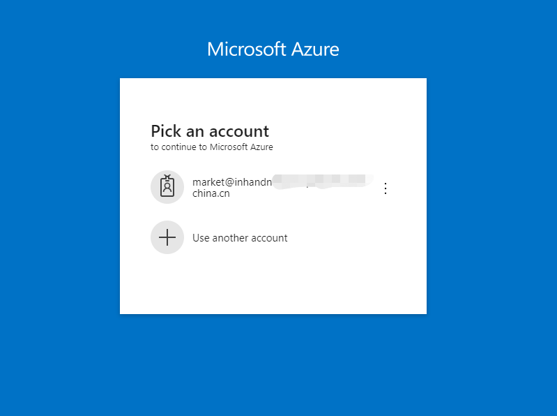

# Azure IoT Edge用户手册
Azure IoT Edge 将云分析和自定义业务逻辑移到设备，这样你的组织就可以专注于业务见解而非数据管理。 通过将业务逻辑打包到标准容器中，横向扩展 IoT 解决方案，然后可以将这些容器部署到任何设备，并从云中监视所有这些设备。关于Azure IoT Edge的详细介绍请参考[了解 Azure IoT Edge 模块](https://docs.azure.cn/zh-cn/iot-edge/iot-edge-modules)。  
映翰通IG902系列产品提供Azure IoT Edge SDK以支持Azure IoT Edge，使你能够快速开发并完成任务，安全和高效地部署相关服务。该SDK主要通过管理Azure IoT Edge runtime来管理从Azure云平台部署并运行在IoT Edge设备（即IG902）上的IoT Edge模块（docker image）。  
本文档将为你说明如何基于Azure IoT Edge SDK实现通过Azure云平台在IG902上部署并运行一个模拟遥测数据并发送到IoT Hub的IoT Edge模块。

  - [1. 环境准备](#environmental-preparation)
    - [1.1 配置Azure IoT环境](#configure-azure-iot-environment)
    - [1.2 配置IG902环境](#configure-ig902-environment)
      - [1.2.1 配置IG902连接Internet](#configure-wan)
      - [1.2.2 更新IG902软件版本](#update-ig902-software-version)
    - [1.3 修改Azure IoT Edge配置文件](#change-azure-iot-edge-configuration-file)
  - [2. 运行Azure IoT Edge](#run-azure-iot-edge)
  - [3. 配置并部署模块](#configure-and-deploy-modules)

  

## 1. 环境准备
开始之前，你需要准备以下事项（如何获取IG902软件版本请联系客服）：
- Azure IoT账户
- IG902固件版本：v2.0.0.r12644及以上
- Docker SDK版本：18.06.3-ce及以上
- Azure IoT Edge SDK版本：1.0.4及以上
- IG902系列产品

  

### 1.1 配置Azure IoT环境
如果你已经在Azure IoT上配置了相应的IoT Hub和IoT Edge设备，可以跳过这一小节。
- 步骤1：登录Azure IoT  
访问<https://portal.azure.cn/>登录Azure。  

    

- 步骤2：添加IoT Hub  
登录成功后如下图所示，选择“IoT Hub”。  

    

  点击“Add”创建一个IoT Hub。  

    

    

  创建成功后如下图所示：  

    

- 步骤3：添加IoT Edge设备  
  在“IoT Hub”中点击相应的IoT Hub，并进入该IoT Hub的“IoT Edge”页面，点击“Add an IoT Edge device”。  

    

  配置相应的参数并点击“Save”。  

  

  

- 步骤4：复制IoT Edge设备的连接字符串  
  IoT Edge设备创建成功后如下图所示：  

    

  点击IoT Edge设备的“Device ID”进入该IoT Edge设备的详情页面，复制“Primary Connection String”参数以备后续使用。  

  

  

### 1.2 配置IG902环境

  

#### 1.2.1 配置IG902连接Internet
配置IG902连接Internet，请参考[IG902连接Internet](http://manual.ig.inhand.com.cn/zh_CN/latest/IG902%E5%BF%AB%E9%80%9F%E4%BD%BF%E7%94%A8%E6%89%8B%E5%86%8C.html#wan-internet)。

  

#### 1.2.2 更新IG902软件版本
- 更新IG902固件版本  
  如何更新IG902固件版本请参考[更新IG902软件版本](http://manual.ig.inhand.com.cn/zh_CN/latest/IG902%E5%BF%AB%E9%80%9F%E4%BD%BF%E7%94%A8%E6%89%8B%E5%86%8C.html#id1)。
- 更新IG902 Docker SDK  
  如何更新IG902 Docker SDK请参考[安装Docker SDK](http://docker.ig.inhand.com.cn/zh_CN/latest/Docker%E7%94%A8%E6%88%B7%E6%89%8B%E5%86%8C.html#docker-sdkdocker)
- 更新IG902 Azure IoT Edge SDK  
  进入“边缘计算 >> 云厂商边缘计算”页面，取消勾选“启用安全守护程序”后，点击“升级”按钮，选择Azure IoT Edge SDK文件并点击“确定”。  
  
    

  

### 1.3 修改Azure IoT Edge配置文件
  在“边缘计算 >> 云厂商边缘计算”页面点击“导出”以导出Azure IoT Edge配置文件。  
  
    

  修改Azure IoT Edge配置文件中的“device_connection_string”参数并保存， 该字符串为[复制IoT Edge设备的连接字符串](#copy-connection-string)获取的IoT Edge设备的“Primary Connection String”参数。  
  
    

  随后导入修改后的Azure IoT Edge配置文件。  

  

  

## 2. 运行Azure IoT Edge
  进入“边缘计算 >> 启动Docker管理”页面，勾选“启动Docker管理器”。  

    

  进入“边缘计算 >> 云厂商边缘计算”页面，勾选“启用安全守护程序”。  

    

  启用安全守护程序后，Azure IoT Edge守护程序会拉取镜像并创建`edgeAgent`容器，镜像文件较大，这需要一段时间，请耐心等待大约20分钟。你可以进入portainer的“LOCAL >> Containers”页面查看是否有`edgeAgent`容器运行，当`edgeAgent`容器运行时，说明Azure IoT Edge已经处于正常工作状态了。
  
    

  

  

  此时，在IoT Edge设备的详情页面可以看到$edgeAgent的“RUNTIME STATUS”为`running`。  

  

  

## 3. 配置并部署模块
- 步骤1：添加IoT Edge模块  

  在IoT Edge设备的详情页面点击“Set Modules”  

    

  在“Set modules on device”页面点击“Add”按钮并选择“IoT Edge Module”以添加IoT Edge模块。  

    

  在“Add IoT Edge Module”弹出框中配置模块名称和镜像URL，这里以`mcr.microsoft.com/azureiotedge-simulated-temperature-sensor:1.0 `镜像为例，该镜像为微软官方提供，模拟遥测数据并发送到IoT Hub。如何开发模块请参考[为Linux设备开发和部署Python IoT Edge模块](https://docs.microsoft.com/en-us/azure/iot-edge/tutorial-python-module)。  

    

  模块添加后如下图所示：  

    

  edgeHub容器监听443端口并默认映射到宿主机（即IG902）的443端口。通常IG902的443端口会被其他程序监听占用，所以需要修改edgeHub容器的映射端口以保证edgeHub可以启动。点击“Runtime Settings”按钮，在“Runtime Settings”弹出框中修改“HostPort”为其他端口，如：`444`。修改完成后点击“Save”  

    

  随后点击“Review + create”，确认无误后点击“Create”，完成IoT Edge模块添加。  

    

  随后`edgeHub`和`mcr.microsoft.com/azureiotedge-simulated-temperature-sensor:1.0 `将自行部署并运行在IG902上，你可以在IoT Edge设备的详情页面查看各个容器的部署情况。当“RUNTIME STATUS”为`running`时说明容器已部署并正常运行。（两个镜像大小之和约为400MB，部署时间约为20分钟或更长，请耐心等待）  

  

- 步骤2：查看容器运行情况

  访问portainer的“LOCAL >> Containers”页面，可以看到有三个容器已经在运行起来了。  

    

  点击`EIP-demo-edge-module`容器的“Logs”按钮查看容器的运行日志，当日志如下图所示说明容器已正常运行：模拟模拟遥测数据并发送到IoT Hub。  

  

  

至此，完成了通过Azure云平台在IG902上部署并运行一个模拟遥测数据并发送到IoT Hub的IoT Edge模块。