# InGateway902 Docker用户手册
InGateway902系列边缘计算网关（以下简称IG902）支持托管docker镜像，您可以将您的docker镜像发布到IG902上，快速部署和运行您自行开发的应用程序。为了说明如何使用IG902的Docker环境，本文档将演示如何在IG902上运行一个Nginx镜像，该镜像用于HTTP，HTTPS，SMTP，POP3和IMAP协议的开源反向代理服务器，以及负载平衡器，HTTP缓存和Web服务器。   
Docker 是一个开源的应用容器引擎，让开发者可以打包他们的应用以及依赖包到一个可移植的容器中,然后发布到任何流行的Linux机器或Windows 机器上,也可以实现虚拟化,容器是完全使用沙箱机制,相互之间不会有任何接口。

  - [1.准备IG902硬件设备及其网络环境](#prepare-ig902-hardware-and-network-environment)
    - [1.1 接通IG902电源并使用网线连接PC](#connect-ig902-to-the-power-source-and-to-a-pc-with-a-network-cable)
    - [1.2 访问IG902](#set-lan-parameters)
    - [1.3 IG902连接Internet](#set-wan-parameters)
    - [1.4 更新IG902固件版本](#update-the-firmware)
  - [2.启用并配置Docker管理器](#enable-and-configure-docker-manager)
    - [2.1 安装Docker SDK并启用Docker管理器](#install-docker-sdk-and-enable-docker-manager)
    - [2.2 配置Docker管理器--Portainer](#configure-docker-manager-portainer)
      - [2.2.1 访问Portainer](#access-portainer)
      - [2.2.2 添加docker镜像](#add-docker-image)
      - [2.2.3 配置并部署容器](#configure-and-deploy-container)
  - [附录](#appendix)
    - [在容器中调用串口进行通讯](#call-the-serial-port-in-the-container-for-communication)
    - [设置容器永久运行](#set-the-container-to-run-permanently)
    - [在IG902中运行Ubuntu](#run-ubuntu-in-ig902)
    - [通过容器构建镜像（创建镜像保存容器配置）](#build-images-from-containers)
    - [如何从gitlab/github上下载docker镜像](#how-to-download-docker-images-from-gitlab-github)
  - [FAQ](#faq)
    - [在“Images”页面拉取镜像提示成功，但是在“Images”页面中未显示拉取到的镜像](#q1)

  

## 1.准备IG902硬件设备及其网络环境

  

### 1.1 接通IG902电源并使用网线连接PC
接通IG902的电源并按照拓扑使用以太网线连接PC和IG902。  

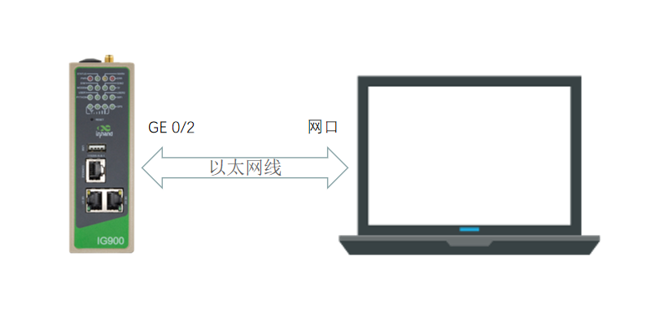

  

### 1.2 访问IG902
访问IG902，请参考[访问IG902](http://manual.ig.inhand.com.cn/zh_CN/latest/IG902%E5%BF%AB%E9%80%9F%E4%BD%BF%E7%94%A8%E6%89%8B%E5%86%8C.html#lan-ig902)。

  

### 1.3 IG902连接Internet
设置IG902联网，请参考[IG902连接Internet](http://manual.ig.inhand.com.cn/zh_CN/latest/IG902%E5%BF%AB%E9%80%9F%E4%BD%BF%E7%94%A8%E6%89%8B%E5%86%8C.html#wan-internet)。

  

### 1.4 更新IG902固件版本
如需获取IG902产品最新固件版本及其功能特性信息，请联系客服。如需更新IG902的固件版本，请参考[更新IG902软件版本](http://manual.ig.inhand.com.cn/zh_CN/latest/IG902%E5%BF%AB%E9%80%9F%E4%BD%BF%E7%94%A8%E6%89%8B%E5%86%8C.html#id1)。（固件版本应为2.0.0.r12057及以上）

  

## 2.启用并配置Docker管理器

  

### 2.1 安装Docker SDK并启用Docker管理器
Docker SDK集成了运行docker镜像所需的运行环境以及docker镜像管理器，在使用Docker前必须先安装Docker SDK。如需获取Docker SDK请联系客服。   
- 步骤1：已有Docker SDK后，进入IG902的“边缘计算>>Docker管理”页面，关闭Docker管理器并导入Docker SDK。  

  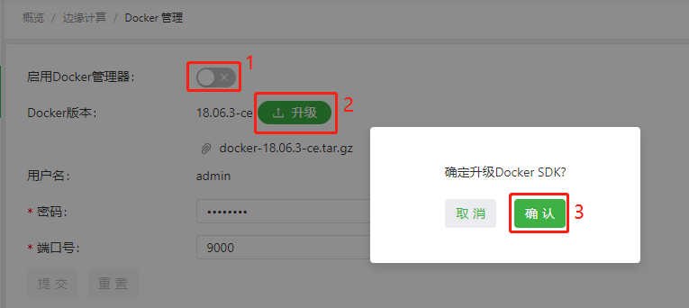  

- 步骤2：导入后，IG902将自动安装Docker SDK，安装过程通常需要1-2分钟，请耐心等候。安装成功后，勾选启用Docker管理器并点击“提交”。  

  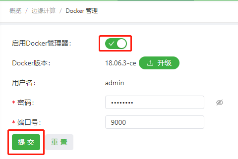  
   
- 步骤3：启用Docker管理器后，可以修改访问Docker管理器的端口号和登录密码。  

  

  

### 2.2 配置Docker管理器--Portainer
IG902使用Portainer构建，管理和维护Docker镜像和容器。关于Portainer的详细介绍和使用说明请查看[Portainer官网](https://www.portainer.io/overview/)。本文档将为您演示如何在IG902上添加并部署运行一个Nginx docker镜像。

  

#### 2.2.1 访问Portainer
- 步骤1：点击Portainer的访问按钮，随后Portainer会提示您需要输入用户名和密码。此时从IG902的“边缘计算>>Docker管理”页面复制用户名和设置的密码后并点击“登录”即可。  

  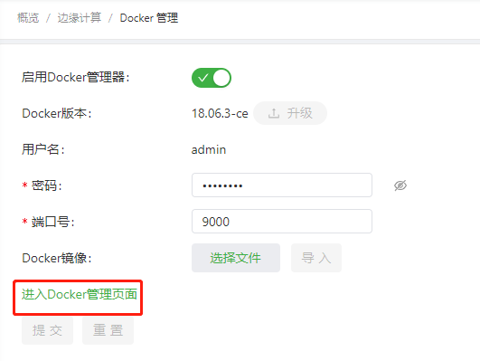  

    
   
- 步骤2：登录成功后如下图所示，选择“Local”以使用Portainer管理IG902上的docker镜像，随后点击“Connect”。  

    
   
- 步骤3：在Portainer的“Home”页面，选择local以管理IG902上的docker镜像。  

    
   
  随后会跳转至本地仪表板，可在此页面概览IG902的容器和镜像等信息。  

  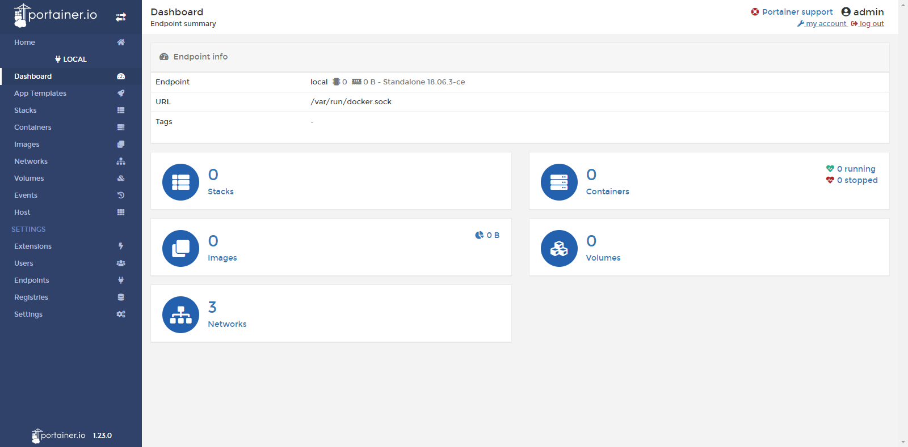

  

#### 2.2.2 添加docker镜像
为Portainer添加docker镜像的方法有两种：
- 方法1：进入Portainer的“Local>>Images”页面，点击“Import”导入镜像  

  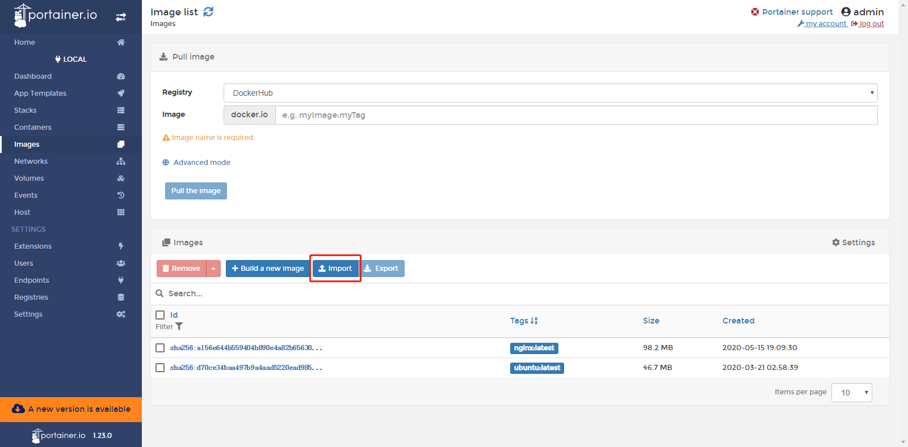

- 方法2：进入Portainer的“Local>>Images”页面，从DockerHub中下载“nginx”docker镜像。（下载镜像所需时间根据镜像大小而不同；当docker镜像较大时，请耐心等待）  

  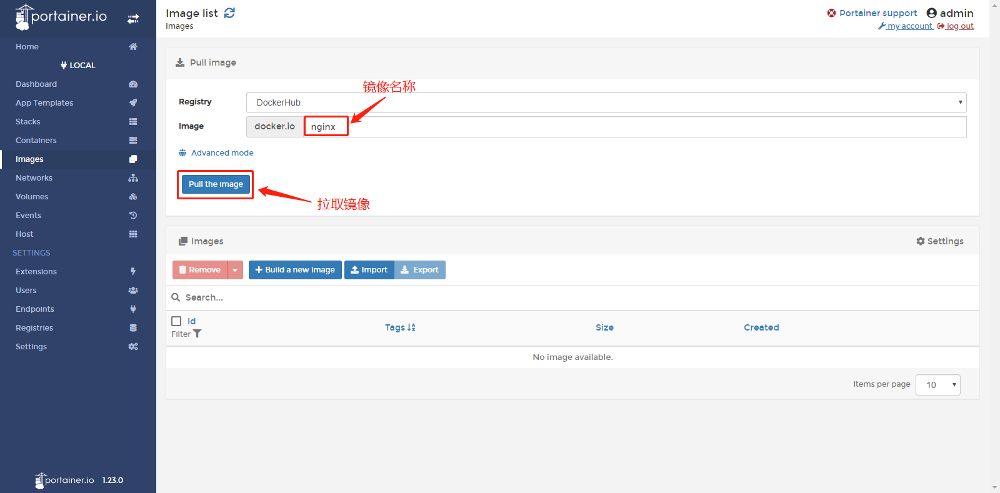  
   
  docker镜像下载完成后如下图所示，在Portainer的“Local>>Images”中能够看到相应的docker镜像信息。  

  

注意：因为IG902的CPU架构为linux/arm/v7，因此只有支持linux/arm/v7架构的镜像可以正常在IG902中运行，其他如window/amd64等架构的镜像可能无法正常导入、拉取或在IG902中运行。  

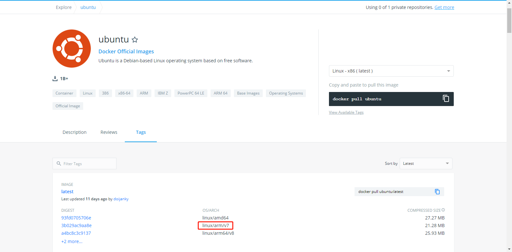

  

#### 2.2.3 配置并部署容器
- 步骤1：进入Portainer的“Local>>Containers”页面，点击“Add container”以添加一个新容器。  

    
   
- 步骤2：为容器配置运行参数并部署容器。  

    
   
- 步骤3：部署后容器会自动运行，在Portainer的“Local>>Containers”页面可以查看容器运行情况。  

    
   
- 步骤4：在浏览器中输入容器中配置的Nginx访问链接（IG902的IP地址 + 端口号）后可以看到Nginx的欢迎页面。说明Nginx docker镜像已正常运行在IG902上；至此，完成了在IG902上添加并部署运行一个Nginx docker镜像。  

  

  

## 附录

  

### 在容器中调用串口进行通讯
部署容器时，在Portainer的“Advanced container settings>>Volumes”页面添加一条“Volume mapping”。下图将IG902的dev目录中的文件映射到了容器中的dev目录下（IG902的dev目录中包含了相应的接口文件）：  

  

在Portainer的“Advanced container settings>>Runtime & Resouces”页面启用“Privileged mode”（未启用时使用串口会提示没有操作权限）  

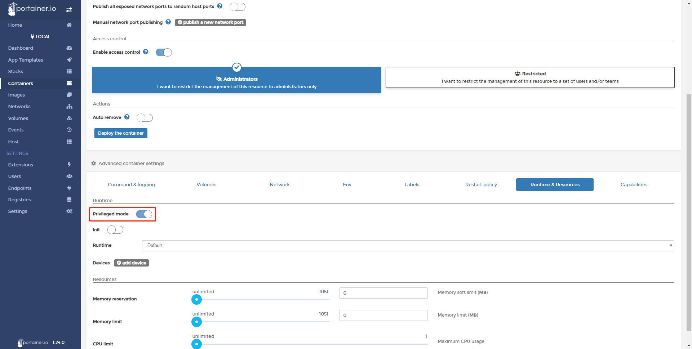

设置完毕后部署容器，随后在容器的console中进入dev目录可以看到`ttyO1`，`ttyO3`等接口文件。  

  

### 设置容器永久运行
部署容器时，在Portainer的“Advanced container settings>>Restart policy”页面选择“Restart policy”为“Always”，设置为“Always”后容器只要停止运行则会自动重启容器。  

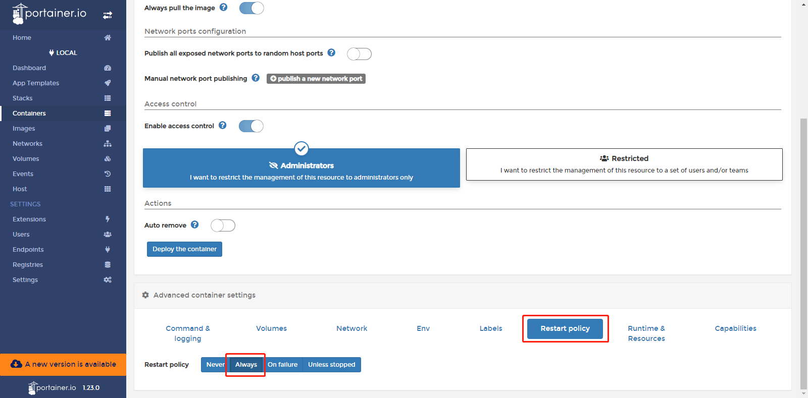

  

### 在IG902中运行Ubuntu
- 步骤1：在Portainer的“Local>>Images”页面拉取Ubuntu镜像，如下图所示：  

  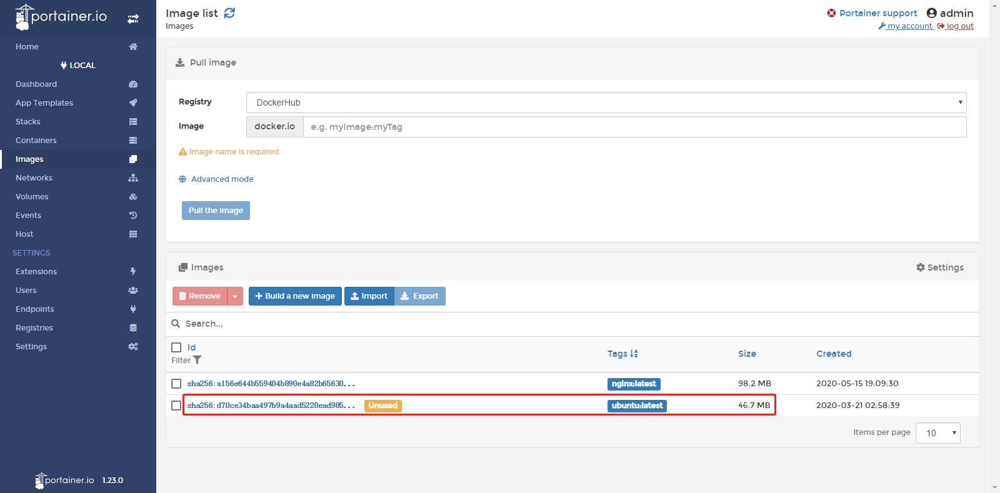  

- 步骤2：进入Portainer的“Local>>Containers”页面，点击“Add container”以添加一个新容器。容器所使用的镜像选择上一步下载的Ubuntu镜像，同时在“Advanced container settings>>Command &logging”中勾选“Console”中的“Interactive & TTY (-i -t)”项。配置完成后点击“Deploy the container”部署容器。  

  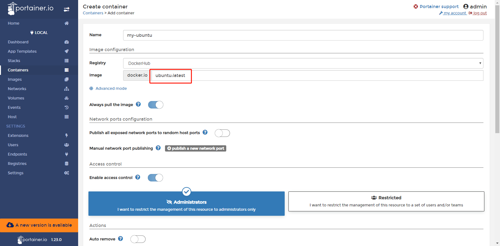  

  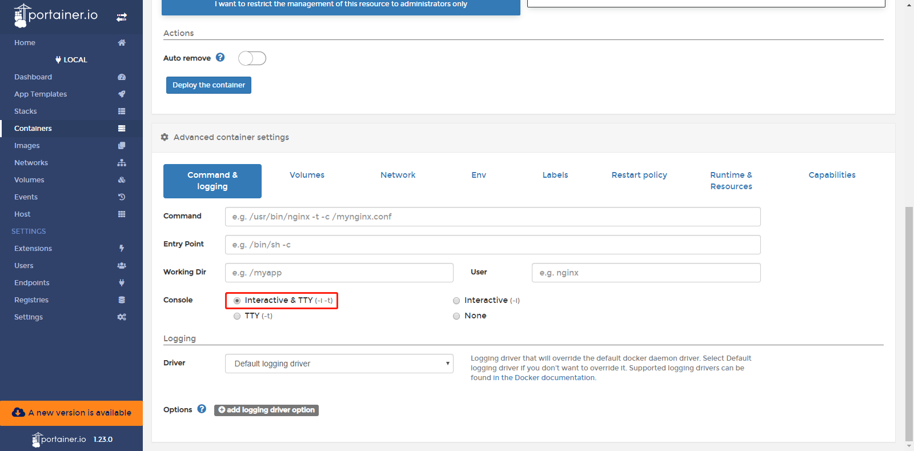  

- 步骤3：部署后在Portainer的“Local>>Containers”页面可看到容器已运行，点击“Exec Console”登录控制台。  

  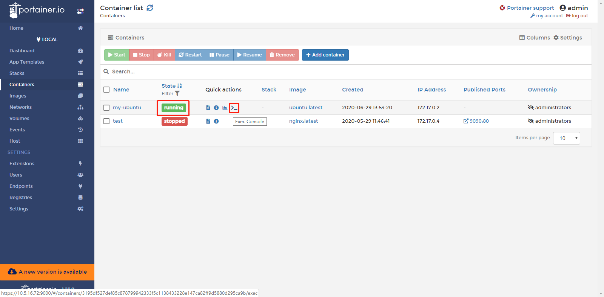  

  在Exceute中点击“Connect”后进入容器内部运行相应命令。  

    

  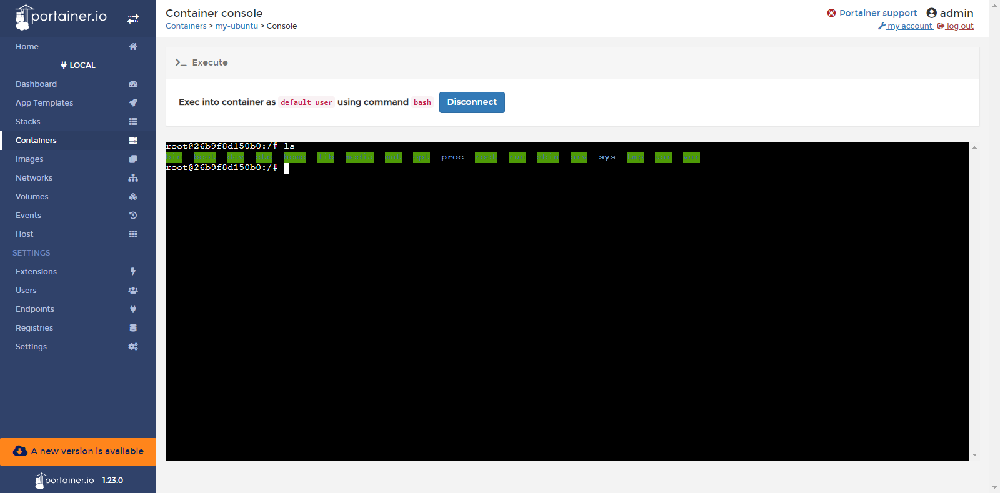

  

### 通过容器构建镜像（创建镜像保存容器配置）
当容器中已配置好相应的开发或运行环境，如果需要保存容器中的环境配置，可以根据容器的更改创建一个新的镜像。方法如下（以Ubuntu容器安装ping工具为例）：  
- 步骤1：配置容器的开发或运行环境  
  分别运行`apt-get update`和`apt-get install inetutils-ping`命令安装ping工具。  

  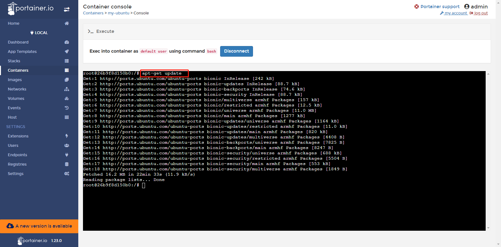  

  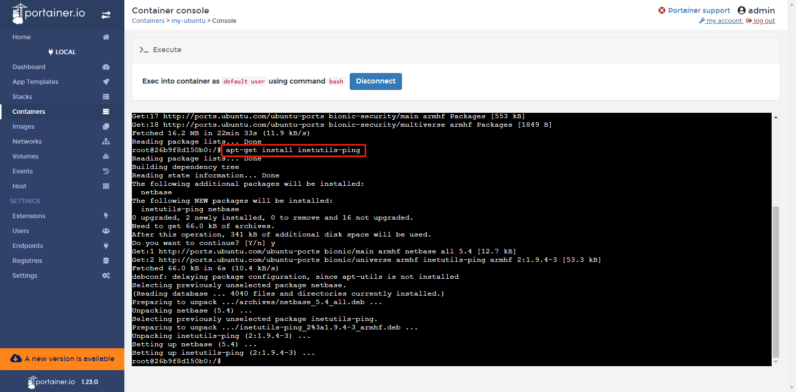  

- 步骤2：根据容器创建镜像  
  点击容器名称进入容器的详情页面  

    

  在详情页面的“Create image”中配置镜像的名称并点击“Creat”

  

- 步骤3：使用创建的镜像部署容器  
  镜像创建完成后可以在Portainer的“Local>>Images”页面查看  

  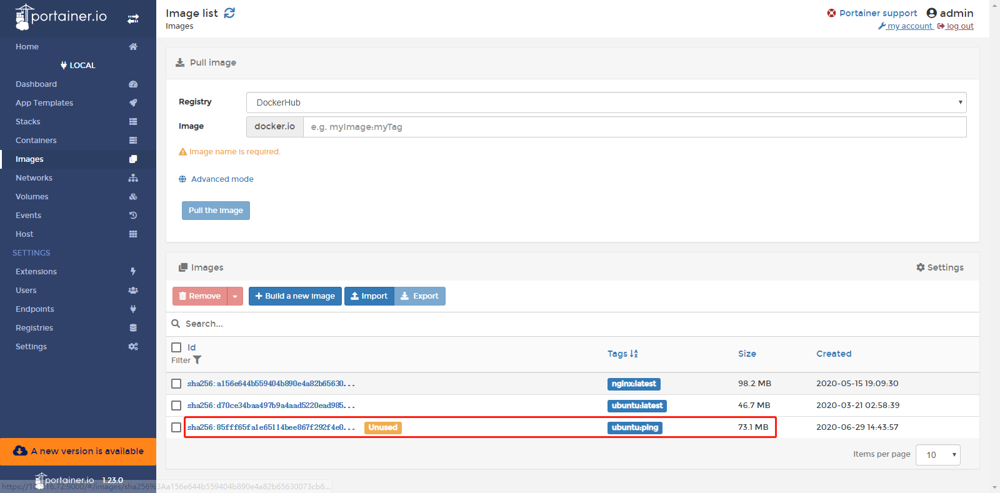  

  随后在Portainer的“Local>>Containers”页面通过创建的镜像来部署一个ubuntu容器，如下图所示：  

    

  登录该容器的控制台，可以正常使用ping命令  

  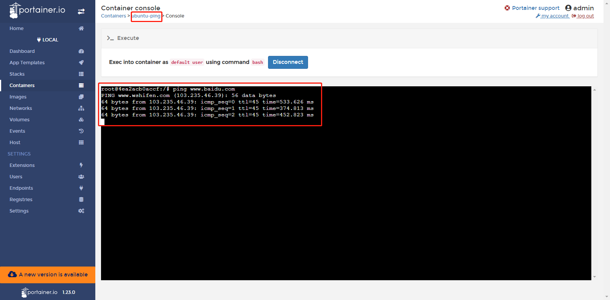

  

### 如何从gitlab/github上下载docker镜像
在Portainer的“Local>>Registries”页面点击“Add registry”以添加docker镜像仓库（必须为公开的仓库）。  

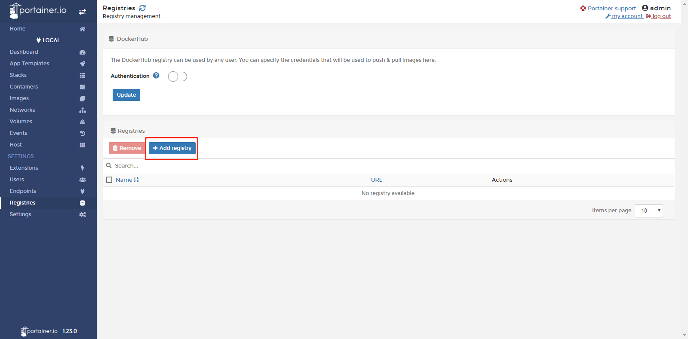  

随后选择“Custom registry”并配置镜像仓库信息，配置完毕后点击“Add registry”。  

  

镜像仓库添加成功后如下图所示：  

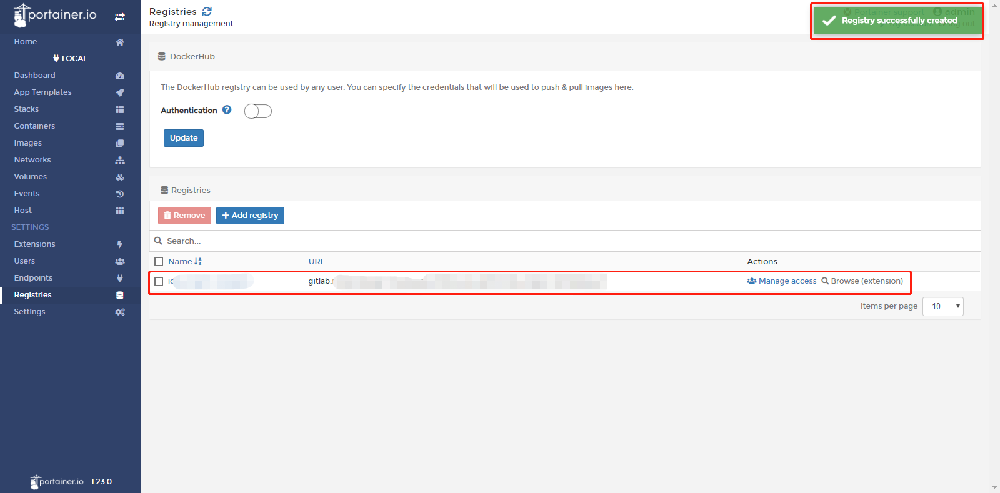  

添加成功后，在拉取docker镜像时可以选择已配置的镜像仓库。  

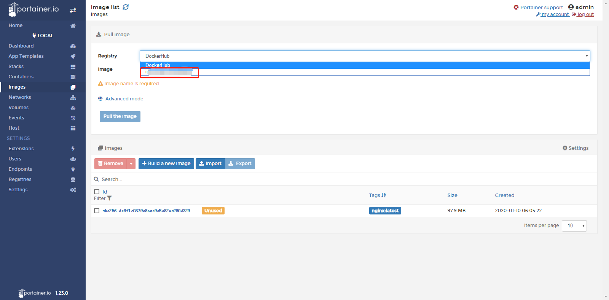

## FAQ

  

### Q1：在“Images”页面拉取镜像提示成功，但是在“Images”页面中未显示拉取到的镜像。
  
A1：因为IG902的CPU架构为linux/arm/v7，因此只有支持linux/arm/v7架构的镜像可以正常在IG902中运行，其他如window/amd64等架构的镜像可能无法正常导入、拉取或在IG902中运行。请确认拉取的镜像是否支持linux/arm/v7。  

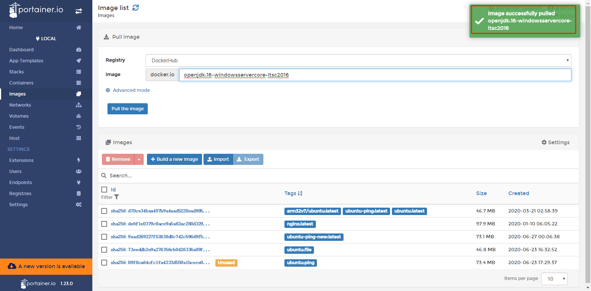  

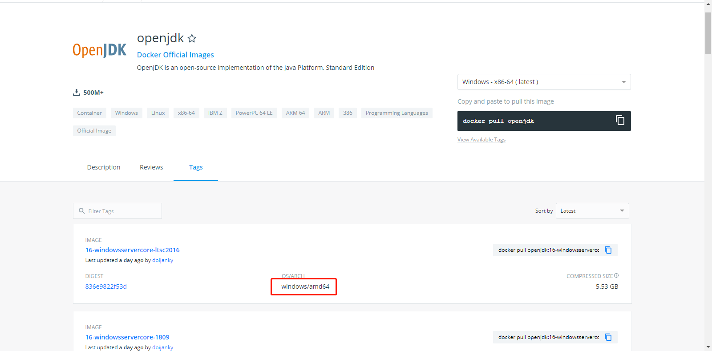
